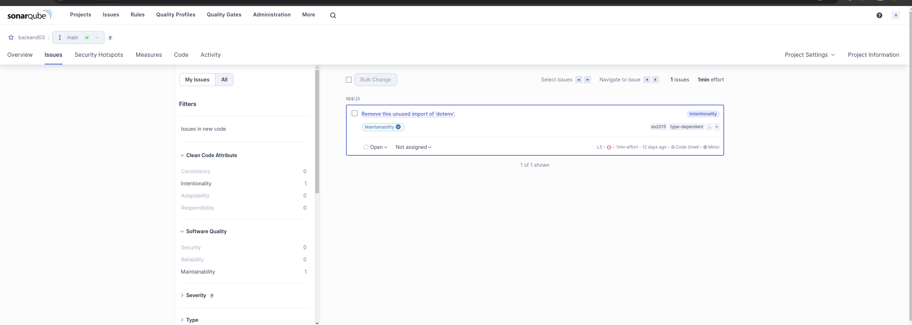

# Hackathon 3 - DevOps IT Talent 2024

## INTRODUÇÃO
Nesse primeiro período que se compreende do início das aulas até esse terceiro hackathon, o mentorando teve contato com conteúdo que balizaram a trilha DevOps, como por exemplo: Introdução a DevOps, Redes de computadores, Linux, Shell Scripting, 12 Factors App, Docker, CI/CD com Github Actions e Jenkins, AWS e Iniciação à Orquestração com Kubernetes. Baseado nesse conteúdo, propomos um desafio no estilo Hackathon, onde os alunos irão colocar à prova os conhecimentos adquiridos até aqui.

## PRÉ-REQUISITOS
- Docker instalado
- Conta de Github e AWS

## DESAFIO
O desafio consistirá em duas etapas:
1. Criação de um projeto do SonarQube como contêiner e execução local
2. Subida do build de uma aplicação React para um S3 da AWS usando GitHub Actions

## OBJETIVOS ESPECÍFICOS

### 1. SonarQube
a. Para essa atividade, iremos criar um projeto do SonarQube, utilizando como projeto base o nosso repositório de backend: [moisesAlc/Backend-IT_Talent](https://github.com/moisesAlc/Backend-IT_Talent). Faça um clone do repositório para o seu computador.

b. Em seguida, precisaremos entender como utilizar o SonarQube na versão de contêiner. Podemos ter uma visão inicial sobre qualquer projeto que esteja no DockerHub, dando uma olhada na página do projeto: [sonarqube - Official Image | Docker Hub](https://hub.docker.com/_/sonarqube)

c. Você não usará o SonarQube em produção, então, poderá se utilizar desse passo-a-passo para executar a versão de contêiner local: [Try out SonarQube](https://docs.sonarqube.org/latest/setup/get-started-2-minutes/)

d. Deverá baixar o SonarScanner CLI também: [SonarScanner CLI](https://docs.sonarqube.org/latest/analysis/scan/sonarscanner/)

e. Siga os passos do PDF em anexo.

### 2. CI/CD com GitHub Actions e AWS
a. Para essa atividade, você deverá criar um workflow do GitHub Actions que irá realizar o build de uma aplicação React [moisesAlc/ReactBasic](https://github.com/moisesAlc/ReactBasic) e, em seguida, subir o conteúdo desse build (que estará na pasta /build) para um bucket S3 da AWS que seja acessível publicamente.

## Entregáveis:
• Prints dos resultados do escaneamento do Sonarqube:

  

• Print do token gerado:

•O Print do ID do recurso do seu S3 no Console AWS:

 •Print de acesso ao link público com o build sendo acessado

###

# Hackathon 3 - DevOps IT Talent 2024

## Resumo
###  Backend com SonarQube
- Clonei o repositório de backend do GitHub ([moisesAlc/Backend-IT_Talent](https://github.com/moisesAlc/Backend-IT_Talent)).
- Configurei e executei o contêiner do SonarQube utilizando a imagem oficial do Docker Hub.
- Baixei e configurei o SonarScanner CLI.
- Executei a análise do código utilizando o SonarScanner, seguindo as instruções fornecidas.

### CI/CD com GitHub Actions e AWS
- Criei um workflow do GitHub Actions no repositório de uma aplicação React ([moisesAlc/ReactBasic](https://github.com/moisesAlc/ReactBasic)).
- Configurei o workflow para realizar o build da aplicação React.
- Configurei o workflow para subir o conteúdo do build para um bucket S3 na AWS, utilizando credenciais configuradas como secrets no GitHub.
- Verifiquei se o workflow foi executado corretamente e se o build foi enviado para o bucket S3.

## Conclusão
Este desafio consolidou os conhecimentos em diversas áreas da trilha DevOps, promovendo a prática em cenários reais. As habilidades desenvolvidas incluem a utilização de contêineres com Docker, configuração de pipelines CI/CD com GitHub Actions, e a integração com serviços de nuvem AWS.

## Ferramentas Utilizadas :
-  Docker
-  SonarQube
-  SonarScanner CLI
-  GitHub Actions
-  AWS S3

## 

